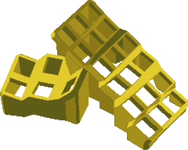

# keyboard

**_Hand-soldered ergonomic split 3x6 keyboard with 5 thumb keys_**

Designed for the [RP2040 Zero](https://circuitpython.org/board/waveshare_rp2040_zero/) and [Kailh Choc](https://kailhswitch.net/products/kailh-low-profile-mechanical-keyboard-switch-brown-red-white-switch-for-diy-gaming-keyboard-mx-switches) low profile key switches.
Check it out in the [QMK Configurator](https://config.qmk.fm/#/handwired/tenstad/LAYOUT_split_3x6_5).

See [Building My First REAL Handwired Split Mechanical Keyboard](https://youtu.be/X-Rxycu0204) by [Joe Scotto](https://www.youtube.com/@joe_scotto) for an intro, and the more detailed [How to Build a Handwired Keyboard](https://youtu.be/hjml-K-pV4E) for an in-depth guide to hand-soldered keyboards.

## Model

[OpenSCAD](https://openscad.org/) model in [keyboard.scad](./keyboard.scad).
See live render in [OpenScad Playground](https://ochafik.com/openscad2/#H4sIAAAAAAAAA+0ca3OjOPKv6HxXW3YCDmA7rx3v1H25z1d1HwnlwgbH3GDIAXk4M/nv190SQoiH7WQ8M1e37E4stVrql7rVkoy/Dh78zN/mg9uvA39VRE/hP/1iM7gdXDzE/u4+Sx+TYJyv/GBgDPL0MVuFgOp+hV5dWKs0KcKkgMZVGi8e0jwqojTJ2Zy5dwmDx2WTsWMw15xcjS8Nxszr8cxgV2PH84w6BrQ5FmJcja8MNhtPFAzGLMKgT/lhVRimM7YRw77BT3hMIDYdzxSM2fgaMSY3yIdpz8Y3gGgrfJiXnI/ZJTaZjkMM21PC8H6/S76Eu0WWFr4uostM6GDx/z0Udm+VNQBKnbE6iuTQJdi1ggmFWb1q1aumrQMUfNDaTEVRCdV53l9lDUBNItaQCDV6lxSbx+1yka7XeVigSk17ChxNAMu2EIO3l1onDJDfJMku+RC1mbegDur8m6GgNk09A6eaMq1wUtnImOnUxKeGqc1luBZdGjOgQYr6OaphJ6WaGAcg29OZhFT6tgHIHGqwEdGZlT0dIM97MgVSKRBZevbjuMHO3WBs4jO+Gxgl5NsLg/++qRByp286DhYMdZwSohFVyZHbiUclyl6q/5qkWTsD3wF/bFbPWGH+PouCxSaM7jc442YAW6ZZEGatsOcoKDYAmiho+ZfwGUAOgvw8XIQvReZXvRHuJ/dxiN0sqKz8B1TU2o/zUKovj14RwZ6Mr2diZj1t/ew+wkl+IyByTHvsUM8oycOsqPzFHmNnAQ3CB+LVUoE1tu6SzYMfLJYp9QXAU71KrUX6oLZW1btk/ZisyA/rjpA+hdk6Tp+HEmQw8EqDZekzlXIq5iM258aBCvsDGGW//UblT9SMNUCWLVj+RN15r89Mju8CvudCk8ebbjuG5K3tXQHFggYLOiMN0/ZK7FvyN/Liutj1UCPFliCDbdJtSFLrqkASUv5+KeVwNQHjsBiWDDIWRBlYpZLCtAHFNiqEKAnClxpKKSgza4iqTIBfEacRPAUzo3mi4ruW2r6R0xK5O2NDOc/PmepOI6UPOYoSRiqu8mo2uUKrnuDJtT11DHzyKEF8HWwK+EHjqLKAhLqstgdylDKeCc55jxGDWVUY2EubMQAevhhsBxMAPlbw6ctZULdoDPTy/2QFzKbn4QsYCTs4I6CJgB0CdghQOcZw7wOGj+oSnUbsgsUjydfqBdpj4BdRliPkQQBQNctRk1/S1WLrF1n0Mqy4dV0cwUedidF81wH90Tg+zISRGLOBgmxRWcVxGiZsPM1O+sDnLcQBLg1ZY7mi28myRIGRVeqVtO9kuRrYrBGXA1cs67OXhjBaejWdoJcd2cnTTJ7H0SocxlEOEzgv/Aw+4jC5Bz+Vpl+nGRtGc5eab3mriZJhLzfSR3zI0n+HK1iQ0uekCo7N4SwcSkGgIV0lAnkYYFgNgOmRpROkJR3Q9kVi8tlqbVI9kQ1rIRG9v85cLRA+l+1ycLWdB2exIgk+IABjiDZ7Qu9HV5fS50ttLKIkCbNhO70+BVU9yg1FBZErY12O2nDwB1SgrvyCtXarCT4P5Y7xePoKdTXNgKl5HxZtxGtpx3xeYVYSfNaCMT6US2PGLsia2srnad634uvjgamRlE/hUxuQr0GuENdr+vpZI1y7JnJBXkNGGh3UCYWkfty5Du4k+8GG5HBKQp3H0tGU39L5vLFetw+3bMrJww7MKIjPSxyIlvPGYmguz7FlpNhCT8zwUbarhyfKQFWft0ZjWMwRKFyXA5ByJjpmmYg1dTSkqAS54LdvvDyvIhQkoxi5oHU00jJzSBmbY31m6q7lXIrtTlrm6m1v0ts+NOWOF8zR8kcEtXe7rXXTlPIUroRHg5RnXEVaIMMH5oEDeIjdnD5+y7QD7jqQuU5042BWjqkaEnIb5HfQuqOkD1ptvfUVWl/Lvo6nTuCPR1PObnNG9kTW5q6Q63WI3mMgoLYV5I1zuYZ0pMLQjbsO7YDObQ/3bOfl/mzECuAMNxegPShhwUFf56NjrpPV+YItLG5yF7CdDaLkfgifBnsO4rmFHxl9FLxWQA24Ym1s4W54tQG14cbdtbW5g7tkV26vzxCb4rAGwtDzVAc5TdBENzyTW3Nt5AokR65AThM08aQaXfeB51cYvw2IgDSEXpuImlWrTal2KWqzltpVDRNqgu45c0H1nBuhTrKCDimaEL2XWx60tX7qe/fHZQgeESVF3jE70WWgsKBJ/hqn8GcTGYxmSwBuEuy6EsYXEemVgAUdqvZdS/tOmqHCqxLjK3V16vYrseYJrsuEmfuu1tCIJa6GQD40xO0izhMaamToo0wIaVch0eYkYp/mbAJRG7QGQRjUJvcm3VZYwGJYRCs/7jAHjIIuCUPOTeXMjgxSnaTstaqiXhF3mI2nx6o6yJkR2NPA6g3VUJ0NJ6HhNaYmYo26tbxJs+g1TYofr+cjtWa3ao03tGjtxDSO1nMQ3ftp8nNmMztwQtk9yuxUzSlpHK3lZRrs3qHhuVsLreUKgXEd+wQ7WvU/NtU7NXeoSvfM6JPRaBpBrHZkBtZqB1BJjxmuuRmsPt1/UN9n9uUF3RWKUqv4RyGxbiTzOKSfzFO3UzE06DYNHuMQthDxboG6H3Ldj9hX3h0bNmGQpYloAQMATdtwjAkmV1NjBhXKs66MS6hghufOoOgYdHl5aVwZE8PhCFPDgm4eUn9ro754tYaQnUrqWmbF76aUGTTBGQQdylxHFMWxYJlTVcK5ob/a4DAGoxLg9zGzQWYgtf4e/Iii45mb93IGnrBM/SzYdwhIl7FyS6fssAhL3XAJsVqPOH+Xx2TN482yjQ426/tc3OOWzVZLe0VdYKF/EwFt05dL1QJ7c9e0b5FNVDABgS8CIn/e6N2HvrWDuy+02S9z8wv9qEHBxK23WbspVhpjPEkRbAbRFieGox9RbaNkqEgnhatkK0VrnjEQTrl7dk3gGgIA/X2lLxpQsarr7Wpz2/D4DMv9tsdvSMu9tQpTt9kuyKmd86hDV7vMSmSLRD636xa1SGqEKjGuyYzJXNAy+Rh+2uLTwZbGNbxn6KzbTZDjSf7FZhGLQbReh1mYrMKh9BZ8HhOYTnWQtIw6XekS42uHCdUp3IWIT7QWJ3XivGxIDu46Z/wgBAr8YASP7+4GL3cDPM9rxZlUOKNOcvjAQgFTWD8qcbs74INbUBjetJG+qJR3zOLKWb3wONEQ4hzTKutH9SrPN8te3Z1k/Gp70GKtBnCEAb6BAfr0jw9fb/Eq6PBtMqYC9bBEW4oeVvEB1wkzeZpcrvMw1nRfT3G5F+JsqV300ZB7e+tZx8H4fLmU1MWiSUR7DfPGwjgP92u+pHOk6ht7uV5e2ps6wOJ7RvKYz6zOEuUqRV9G6qCIU1I9dD86iExacPqDCJ7szUvPApfGp/pWT49v4fNZP+iydJWP8FLnj3kfHm5tBGY/NU7RJCXfMvFh9RgPzyg7ZPskvkH0A+Q7P518hWI7vkB9d9t9+lm2K7Ie2ayT2LFf1tPZ8SML+ZFL6IeWa77id6zC32GIxhWK9uAFEPzjV0Dwj18CwT9+DQT/jlnvHT1Wmu9d7/ce2P654p9uxT9I+Sdc8zvTSGUJ7qB1wOJ9WM+2vcORNNVdx/vzhdPE5ZOtr/34704u/vcWqA8pojcL+b9SxI9PWX5J19jwhOaQc4KeUZ74KIckDsfnVhs6Zed/n+RfzzhVjuF47C8YXllzz9aG8748ZM+F5p9ZyOmykANUf6IcRAO9laei5aMf5u4/7bT2HnZ2OJXckpRbAtXrzWqnUB3/6RARNcv9QJeGDsm5+o9OW43Yc1WNt6J9NjvIMGq1XqODH/8h77bMARaUuAdasST8IU3i067Nrgvnk837luLeK4Dv5xM/fk5aY8uy64HFFDD8koQo7XipV+tHkzardx1rFbP2DiPxob7qSOyYtVcifxpfdTaIM5XV7+Ppovgm7ojvkra7qmUWLPDY2L6m10BLEGbVznTsqLANvUE6USBLf/WFgJclHv/7mC8XmXgNtKwjkRvZGyH0oux4qkACeh31UoUE8rVVZfimY8mb71Xz9W5aAVvexeZA5W1oQlRfMS9rZUfVLO0U6UtLNVoKFXG5rI5SZH6Sx34BicPUYJc3+IZ9i58raPjyuUkmMulrIe1Bgecik7EzvTG4Qc+nvIA5nz69WidNh6b/tk7mtmW1y2Da+H2u6/GUXshvcEZKQb5Azzf1bxjUmN/F+MZlNtzMr8C35o1krz3edmi1U6lNSfCR39UgUzrtHNbsMXYMYRBHqPjCOY/OJuPL7oBdaqJfES0KwV9fyOb2uDMB3h8iDhLA/IUF6M1mFMms0lO6Zxq5CQU34SZCAX0uolExy0hYUsONb69bytB5Xi6jde2bvR6qkadIChMOF+PKfO3kS6OZaDJzj91UEYcUwU3njCL76AJjkCC83/Ykc20Ag8d/UNOsM83uSMZUrmhM4oX429T4O5wrwU3F3Me4atPVO/hTPGaGHsN7vputX5OrNmX9fK5+DaYOTOwGb54xWId+8ZjR7y8Ntn4SrdMYf29p7eeFucrvoRj7rzuTlnOo+HkebR+gAMkgsIhvS6ZZPvBKwD/SbOvjzzTdx0vACl8e0qyoAd+MwVMUPuNPQ8X+Ln0ssLRNgxDat49xEWG3ICrSbHBbZI8hRw9lbfWYF+k2ekUI/dLJG/46VIzog7+ub4IrZ4W/KrVJn//+gmLxXlj/18YPYDfEQW9v/wWNf0Z0pUoAAA==).

The OpenSCAD model is lacking walls between the main matrix and the thumb cluster.
See the STL files for a complete printable version of the [base](./keyboard.stl) and [bottom plate](./keyboard_bottom.stl).

## Parts and Tools

- [RP2040 Zero Microcontroller](https://www.aliexpress.com/item/1005004281549886.html)
- [Kailh Choc Key Switches](https://www.aliexpress.com/item/1005005446722280.html)
- [Kailh Choc Keycaps 50 Pcs](https://www.aliexpress.com/item/1005004558099208.html)
- [Kailh Choc Keycaps 5 Pcs](https://www.aliexpress.com/item/1005005121196711.html)
- [Diodes](https://www.aliexpress.com/item/4000142272546.html)
- [4 Pin 3.5mm Jack Socket](https://www.aliexpress.com/item/1005005623212310.html)
- [4 Pin 3.5mm Jack Cable](https://www.aliexpress.com/item/32905903526.html)
- [2m USB-C Cable](https://www.aliexpress.com/item/1005003913701878.html)
- [1mm Non-Enameled Copper Wire](https://www.aliexpress.com/item/1005006064737053.html)
- [1mm Heat Shrink Tube](https://www.aliexpress.com/item/1005004539897586.html)
- [5mm M3 Flat Head Screw](https://www.aliexpress.com/item/1005005070119421.html)
- [3mm M3 4.5mm OD Insert](https://www.aliexpress.com/item/1005004535859664.html)
- [Rubber Anti-Slip Pads](https://www.aliexpress.com/item/1005004068119765.html)
- [Foam Pad](https://www.aliexpress.com/item/1005004684031433.html)
- [Wrist Rest](https://www.aliexpress.com/item/1005005666324284.html)

- [Angled Tweezers](https://www.aliexpress.com/item/1005005589349988.html)
- [Soldering Iron Stand](https://www.aliexpress.com/item/1005005062045533.html)
- [Soldering Iron Cleaner](https://www.aliexpress.com/item/1005006994305012.html)
